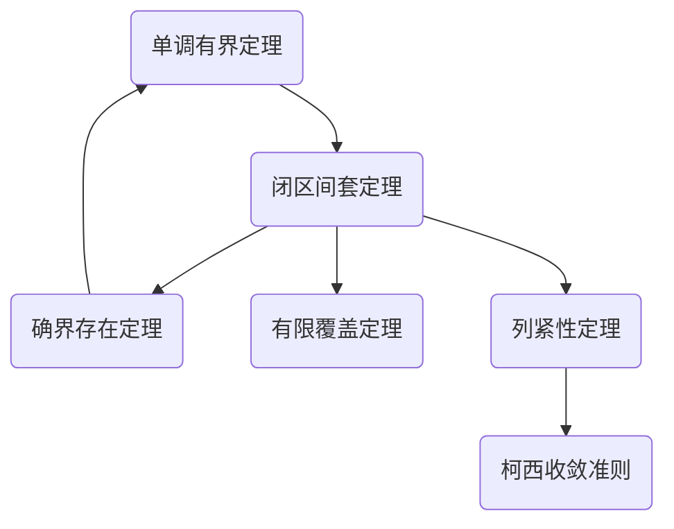

# 数学分析公式结论总结 _——HYX_v1.0_
- [数学分析公式结论总结 _——HYX_v1.0_](#数学分析公式结论总结-hyx_v10)
  - [$\sect0$.常用公式表](#sect0常用公式表)
    - [三角函数](#三角函数)
      - [和差化积：](#和差化积)
      - [积化和差：](#积化和差)
      - [半角公式：](#半角公式)
      - [倍角公式：](#倍角公式)
      - [万能公式：](#万能公式)
      - [其他：](#其他)
  - [$\sect1$.数列极限](#sect1数列极限)
    - [调和-几何-算术平均值不等式：](#调和-几何-算术平均值不等式)
    - [伯努利不等式：](#伯努利不等式)
    - [柯西不等式：](#柯西不等式)
    - [二项式展开：](#二项式展开)
    - [因式分解：](#因式分解)
    - [闵科夫斯基不等式（可以通过几何意义来记忆）：](#闵科夫斯基不等式可以通过几何意义来记忆)
    - [结论：](#结论)
    - [符号/定义：](#符号定义)
    - [数列极限定义：](#数列极限定义)
    - [数列极限的保序性（取0时为保号性）：](#数列极限的保序性取0时为保号性)
    - [自然常数：](#自然常数)
    - [六大定理关系：](#六大定理关系)
    - [其他：](#其他-1)
  - [$\sect2$.函数极限与连续](#sect2函数极限与连续)
## $\sect0$.常用公式表
### 三角函数
#### 和差化积：
$$
\sin{\alpha}+\sin{\beta}=2\sin{\frac{\alpha+\beta}{2}}\cos{\frac{\alpha-\beta}{2}}\\
\sin{\alpha}-\sin{\beta}=2\cos{\frac{\alpha+\beta}{2}}\sin{\frac{\alpha-\beta}{2}}\\
\cos{\alpha}+\cos{\beta}=2\cos{\frac{\alpha+\beta}{2}}\cos{\frac{\alpha-\beta}{2}}\\
\cos{\alpha}-\cos{\beta}=-2\sin{\frac{\alpha+\beta}{2}}\sin{\frac{\alpha-\beta}{2}}
$$
#### 积化和差：
$$
\sin{\alpha}\cos{\beta}=\frac{1}{2}[\sin{(\alpha+\beta)}+\sin{(\alpha-\beta)}]\\
\cos{\alpha}\sin{\beta}=\frac{1}{2}[\sin{(\alpha+\beta)}-\sin{(\alpha-\beta)}]\\
\cos{\alpha}\cos{\beta}=\frac{1}{2}[\cos{(\alpha+\beta)}+\cos{(\alpha-\beta)}]\\
\sin{\alpha}\sin{\beta}=-\frac{1}{2}[\cos{(\alpha+\beta)}-\cos{(\alpha-\beta)}]
$$
#### 半角公式：
$$
\sin\frac{\alpha}{2}=\pm\sqrt{\frac{1-\cos{\alpha}}{2}}\\
\cos\frac{\alpha}{2}=\pm\sqrt{\frac{1+\cos{\alpha}}{2}}\\
\tan\frac{\alpha}{2}=\pm\sqrt{\frac{1-\cos{\alpha}}{1+\cos{\alpha}}}\\
\tan\frac{\alpha}{2}=\frac{1-\cos{\alpha}}{\sin{\alpha}}=\frac{\sin{\alpha}}{1+\cos{\alpha}}
$$
#### 倍角公式：
$$
\sin{2\alpha}=2\sin{\alpha}\cos{\alpha}\\
\cos{2\alpha}=\cos^2{\alpha}-\sin^2{\alpha}=2\cos^2{\alpha}-1=1-2\sin^2{\alpha}\\
1-\cos{\alpha}=2\sin^2{\frac{\alpha}{2}}\\
\tan{2\alpha}=\frac{2\tan{\alpha}}{1-\tan^2{\alpha}}\\
\cot{2\alpha}=\frac{\cot^2{\alpha}-1}{2\cot{\alpha}}\\
\sec{2\alpha}=\frac{\sec^2{\alpha}+\csc^2{\alpha}}{\csc^2{\alpha}-\sec^2{\alpha}}=\frac{\sec^2{\alpha}\csc^2{\alpha}}{\csc^2{\alpha}-\sec^2{\alpha}}\\
\csc{2\alpha}=\frac{\sec^2{\alpha}+\csc^2{\alpha}}{2\sec{\alpha}\csc{\alpha}}=\frac{\sec{\alpha}\csc{\alpha}}{2}\\
(\cos{\theta}+\imath\sin{\theta})^n=\cos{n\theta}+\imath\sin{n\theta}
$$
#### 万能公式：
$$
\sin{\alpha}=\frac{2\tan{\frac{\alpha}{2}}}{1+\tan^2{\frac{\alpha}{2}}}\\
\cos{\alpha}=\frac{1-\tan^2{\frac{\alpha}{2}}}{1+\tan^2{\frac{\alpha}{2}}}\\
\tan{\alpha}=\frac{2\tan{\frac{\alpha}{2}}}{1-\tan^2{\frac{\alpha}{2}}}\\
$$
#### 其他：
$$
\tan{\alpha}=\frac{1}{\cot{\alpha}}\\
\sin{\alpha}=\frac{1}{\csc{\alpha}}\\
\cos{\alpha}=\frac{1}{\sec{\alpha}}\\
$$
## $\sect1$.数列极限
### 调和-几何-算术平均值不等式：
$$
\frac{n}{\frac{1}{a_1}+\frac{1}{a_2}+\cdots+\frac{1}{a_n}}\leq\sqrt[n]{a_1 a_2 \cdots a_n}\leq\frac{a_1+a_2+\cdots+a_n}{n}\quad(a_i>0,i=1,2,\cdots,n)
$$
### 伯努利不等式：
$$
(1+x)^n\geq1+nx\quad(\forall x>-1,n\in \mathbb{N^*})
$$
### 柯西不等式：
$$
(\displaystyle\sum^{n}_{i=1}{a_ib_i})^2\leq(\displaystyle\sum^{n}_{i=1}{a^2_i})(\displaystyle\sum^{n}_{i=1}{b^2_i})
$$
### 二项式展开：
$$
(a+b)^n=\displaystyle\sum^{n}_{k=0}{C^k_na^kb^{n-k}}
$$
### 因式分解：
$$
a^n-b^n=(a-b)(a^{n-1}+a^{n-2}b+\cdots+ab^{n-2}+b^{n-1})
$$
### 闵科夫斯基不等式（可以通过几何意义来记忆）：
$$
(\displaystyle\sum^{n}_{i=1}{(a_i+b_i)^2})^{\frac{1}{2}}\leq(\displaystyle\sum^{n}_{i=1}{a^2_i})^{\frac{1}{2}}+(\displaystyle\sum^{n}_{i=1}{b^2_i})^{\frac{1}{2}}\\
(\displaystyle\sum^{n}_{i=1}{(a_i+b_i)^p})^{\frac{1}{p}}\leq(\displaystyle\sum^{n}_{i=1}{a^p_i})^{\frac{1}{p}}+(\displaystyle\sum^{n}_{i=1}{b^p_i})^{\frac{1}{p}}
$$
### 结论：
$$
\displaystyle\lim_{n\to\infty}{n^{\frac{1}{n}}}=1\\
\displaystyle\lim_{n\to\infty}{\frac{c^n}{n!}}=0(c\neq0)\\
\displaystyle\lim_{n\to\infty}{\frac{n^{\alpha}}{c^n}}=0(\alpha>0,c>1)\\
$$
### 符号/定义：
- $\forall$：任意选取	$\exist$：存在 	冒号：满足的结论
- $
n!!=\begin{cases}
2\cdot4\cdot6\cdots n & n\;mod\;2 = 0\\
1\cdot3\cdot5\cdots n & n\;mod\;2 = 1
\end{cases}
$
- 无穷小/无穷小量：如果数列${a_n}$的极限为零，那么称数列${a_n}$为无穷小（量）
- 欧拉常数($\gamma$)：$1+\frac{1}{2}+\cdots+\frac{1}{n}-\ln{n}=\gamma+\epsilon(n),其中\displaystyle\lim_{n\to\infty}\epsilon(n)=0$；即调和级数与自然对数的差值的极限
- 上/下确界：$sup\ E=\alpha,inf\ E=\beta$

### 数列极限定义：
$$
\forall \epsilon>0,\exist N(\epsilon)\in \mathbb{N^*},\forall n>N:|a_n-a|<\epsilon
$$
### 数列极限的保序性（取0时为保号性）：
(1)设$\displaystyle\lim_{n\to\infty}{a_n}=a,\alpha<a<\beta$,则存在$N\in \mathbb{N^*}$,使得当$n>N$时,有$\alpha<a_n<\beta$

(2)设$\displaystyle\lim_{n\to\infty}{a_n}=a,\displaystyle\lim_{n\to\infty}{b_n}=b$,且$a<b$,则存在$N\in \mathbb{N^*}$,使得当$n>N$时,有$a_n<b_n$

(3)设$\displaystyle\lim_{n\to\infty}{a_n}=a,\displaystyle\lim_{n\to\infty}{b_n}=b$,若存在$N\in \mathbb{N^*}$,使得当$n>N$时,有$a_n\leq b_n$,则$a\leq b$

### 自然常数：
$$
\displaystyle\lim_{n\to\infty}{(1+\frac{1}{n})^n}=\displaystyle\lim_{n\to\infty}{(1+\frac{1}{1!}+\frac{1}{2!}+\cdots+\frac{1}{n!})}=\mathrm{e}\\
\displaystyle\lim_{n\to\infty}{(1+\frac{k}{n})^n}=\mathrm{e}^k,\qquad\displaystyle\lim_{n\to\infty}{(1-\frac{k}{n})^n}=\mathrm{e}^{-k}\quad (k\in \mathbb{N^*})\\
x_n=(1+\frac{1}{n})^n单调递增,y_n=(1+\frac{1}{n})^{n+1}单调递减\\
(1+\frac{1}{n})^n<\mathrm{e}<(1+\frac{1}{n})^{n+1}\iff n\ln(1+\frac{1}{n})<1<(n+1)\ln(1+\frac{1}{n})\iff \frac{1}{n+1}<\ln(1+\frac{1}{n})<\frac{1}{n}\\
\frac{k}{n+k}<\ln(1+\frac{k}{n})<\frac{k}{n}
$$
### 六大定理关系：

### 其他：
(1)对$x\geq0,y\geq0,n\in \mathbb{N^*},$有
$$
(x+y)^n\geq x^n+y^n,\qquad(x^n+y^n)^{\frac{1}{n}}\leq x+y\\
(x+y)^{\frac{1}{n}}\leq x^{\frac{1}{n}}+y^{\frac{1}{n}},\qquad|x^{\frac{1}{n}}-y^{\frac{1}{n}}|\leq|x-y|^{\frac{1}{n}}
$$
(2)
$$
\displaystyle\lim_{n\to\infty}{(a_1+a_2+\cdots+a_n)}=s\Rightarrow\displaystyle\lim_{n\to\infty}{\frac{a_1+2a_2+\cdots+na_n}{n}}=0
$$
(3)
$$
n<\sqrt{(n-1)(n+1)}\Rightarrow\frac{(2n-1)!!}{(2n)!!}<\frac{1}{\sqrt{(2n+1)}}\quad(n\in \mathbb{N^*})
$$
(4)
$$
\displaystyle\lim_{n\to\infty}{(1+\frac{1}{2^{\alpha}}+\cdots+\frac{1}{n^{\alpha}})}=\begin{cases}
不存在 & \alpha=1\\
存在 & \alpha>1
\end{cases}
$$
## $\sect2$.函数极限与连续

