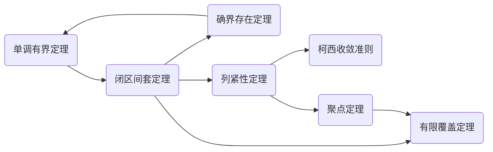

# 数学分析公式结论总结

## Information
- 维护者：Phinney
- 版本：0.2 $\beta$
- 仓库链接：https://github.com/BUAAMogician/Mathematical-Analysis-Reference-for-BUAA
- 参考文献：
  - [1]杨小远.工科数学分析教程(上册)[M].北京：科学出版社，2018.

## 目录
- [数学分析公式结论总结](#数学分析公式结论总结)
  - [Information](#information)
  - [目录](#目录)
  - [$\sect0$.常用公式表](#sect0常用公式表)
    - [三角函数](#三角函数)
      - [和差化积](#和差化积)
      - [积化和差](#积化和差)
      - [半角公式](#半角公式)
      - [倍角公式](#倍角公式)
      - [万能公式](#万能公式)
      - [其他](#其他)
  - [$\sect1$.数列极限](#sect1数列极限)
    - [常用公式\结论](#常用公式结论)
    - [符号/定义](#符号定义)
    - [数列极限定义](#数列极限定义)
    - [数列极限的保序性(取0时为保号性)](#数列极限的保序性取0时为保号性)
    - [自然常数](#自然常数)
    - [六大定理关系](#六大定理关系)
    - [其他](#其他-1)
  - [$\sect2$.函数极限与连续](#sect2函数极限与连续)
    - [集合](#集合)
      - [集合的势](#集合的势)
    - [符号/定义](#符号定义-1)
    - [函数极限](#函数极限)
    - [函数连续](#函数连续)
    - [一致连续](#一致连续)
    - [无穷小与无穷大阶](#无穷小与无穷大阶)
    - [常用极限/结论](#常用极限结论)
    - [有限闭区间上连续函数的整体性质](#有限闭区间上连续函数的整体性质)
  - [$\sect3$.导数的计算与应用](#sect3导数的计算与应用)
    - [常见导数公式](#常见导数公式)
    - [高阶导数](#高阶导数)
    - [微分中值定理](#微分中值定理)

## $\sect0$.常用公式表
### 三角函数
#### 和差化积
$$
\sin{\alpha}+\sin{\beta}=2\sin{\frac{\alpha+\beta}{2}}\cos{\frac{\alpha-\beta}{2}}\\
\sin{\alpha}-\sin{\beta}=2\cos{\frac{\alpha+\beta}{2}}\sin{\frac{\alpha-\beta}{2}}\\
\cos{\alpha}+\cos{\beta}=2\cos{\frac{\alpha+\beta}{2}}\cos{\frac{\alpha-\beta}{2}}\\
\cos{\alpha}-\cos{\beta}=-2\sin{\frac{\alpha+\beta}{2}}\sin{\frac{\alpha-\beta}{2}}
$$
#### 积化和差
$$
\sin{\alpha}\cos{\beta}=\frac{1}{2}[\sin{(\alpha+\beta)}+\sin{(\alpha-\beta)}]\\
\cos{\alpha}\sin{\beta}=\frac{1}{2}[\sin{(\alpha+\beta)}-\sin{(\alpha-\beta)}]\\
\cos{\alpha}\cos{\beta}=\frac{1}{2}[\cos{(\alpha+\beta)}+\cos{(\alpha-\beta)}]\\
\sin{\alpha}\sin{\beta}=-\frac{1}{2}[\cos{(\alpha+\beta)}-\cos{(\alpha-\beta)}]
$$
#### 半角公式
$$
\sin\frac{\alpha}{2}=\pm\sqrt{\frac{1-\cos{\alpha}}{2}}\\
\cos\frac{\alpha}{2}=\pm\sqrt{\frac{1+\cos{\alpha}}{2}}\\
\tan\frac{\alpha}{2}=\pm\sqrt{\frac{1-\cos{\alpha}}{1+\cos{\alpha}}}\\
\tan\frac{\alpha}{2}=\frac{1-\cos{\alpha}}{\sin{\alpha}}=\frac{\sin{\alpha}}{1+\cos{\alpha}}
$$
#### 倍角公式
$$
\sin{2\alpha}=2\sin{\alpha}\cos{\alpha}\\
\cos{2\alpha}=\cos^2{\alpha}-\sin^2{\alpha}=2\cos^2{\alpha}-1=1-2\sin^2{\alpha}\\
1-\cos{\alpha}=2\sin^2{\frac{\alpha}{2}}\\
\tan{2\alpha}=\frac{2\tan{\alpha}}{1-\tan^2{\alpha}}\\
\cot{2\alpha}=\frac{\cot^2{\alpha}-1}{2\cot{\alpha}}\\
\sec{2\alpha}=\frac{\sec^2{\alpha}+\csc^2{\alpha}}{\csc^2{\alpha}-\sec^2{\alpha}}=\frac{\sec^2{\alpha}\csc^2{\alpha}}{\csc^2{\alpha}-\sec^2{\alpha}}\\
\csc{2\alpha}=\frac{\sec^2{\alpha}+\csc^2{\alpha}}{2\sec{\alpha}\csc{\alpha}}=\frac{\sec{\alpha}\csc{\alpha}}{2}\\
(\cos{\theta}+\imath\sin{\theta})^n=\cos{n\theta}+\imath\sin{n\theta}
$$
#### 万能公式
$$
\sin{\alpha}=\frac{2\tan{\frac{\alpha}{2}}}{1+\tan^2{\frac{\alpha}{2}}}\\
\cos{\alpha}=\frac{1-\tan^2{\frac{\alpha}{2}}}{1+\tan^2{\frac{\alpha}{2}}}\\
\tan{\alpha}=\frac{2\tan{\frac{\alpha}{2}}}{1-\tan^2{\frac{\alpha}{2}}}\\
$$
#### 其他
$$
\cot{\alpha}=\frac{1}{\tan{\alpha}}\qquad 余切\\
\csc{\alpha}=\frac{1}{\sin{\alpha}}\qquad 余割\\
\sec{\alpha}=\frac{1}{\cos{\alpha}}\qquad 正割\\
$$
## $\sect1$.数列极限
### 常用公式\结论

- 指数相关：
    $$
    \displaystyle\lim_{n\to\infty}{n^{\frac{1}{n}}}=1\\
    \displaystyle\lim_{n\to\infty}{\frac{c^n}{n!}}=0(c\neq0)\\
    \displaystyle\lim_{n\to\infty}{\frac{n^{\alpha}}{c^n}}=0(\alpha>0,c>1)\\
    $$
    
- 调和-几何-算术平均值不等式
    $$
    \frac{n}{\frac{1}{a_1}+\frac{1}{a_2}+\cdots+\frac{1}{a_n}}\leq\sqrt[n]{a_1 a_2 \cdots a_n}\leq\frac{a_1+a_2+\cdots+a_n}{n}\quad(a_i>0,i=1,2,\cdots,n)
    $$

- 伯努利不等式
    $$
    (1+x)^n\geq1+nx\quad(\forall x>-1,n\in \mathbb{N^*})
    $$

- 柯西不等式
    $$
    (\displaystyle\sum^{n}_{i=1}{a_ib_i})^2\leq(\displaystyle\sum^{n}_{i=1}{a^2_i})(\displaystyle\sum^{n}_{i=1}{b^2_i})
    $$

- 二项式展开
    $$
    (a+b)^n=\displaystyle\sum^{n}_{k=0}{C^k_na^kb^{n-k}}
    $$

- 因式分解
    $$
    a^n-b^n=(a-b)(a^{n-1}+a^{n-2}b+\cdots+ab^{n-2}+b^{n-1})
    $$

- 闵科夫斯基不等式(可以通过几何意义来记忆)
    $$
    (\displaystyle\sum^{n}_{i=1}{(a_i+b_i)^2})^{\frac{1}{2}}\leq(\displaystyle\sum^{n}_{i=1}{a^2_i})^{\frac{1}{2}}+(\displaystyle\sum^{n}_{i=1}{b^2_i})^{\frac{1}{2}}\\
    (\displaystyle\sum^{n}_{i=1}{(a_i+b_i)^p})^{\frac{1}{p}}\leq(\displaystyle\sum^{n}_{i=1}{a^p_i})^{\frac{1}{p}}+(\displaystyle\sum^{n}_{i=1}{b^p_i})^{\frac{1}{p}}
    $$
### 符号/定义
- $\forall$：任意选取	$\exist$：存在 	冒号：满足的结论

- $
  n!!=\begin{cases}
  2\cdot4\cdot6\cdots n & n\;mod\;2 = 0\\
  1\cdot3\cdot5\cdots n & n\;mod\;2 = 1
  \end{cases}
  $
  
- 无穷小/无穷小量：如果数列${a_n}$的极限为零，那么称数列${a_n}$为无穷小（量）

- 欧拉常数($\gamma$)：$1+\frac{1}{2}+\cdots+\frac{1}{n}-\ln{n}=\gamma+\epsilon(n),其中\displaystyle\lim_{n\to\infty}\epsilon(n)=0$；即调和级数与自然对数的差值的极限

- 上/下确界：$sup\ E=\alpha,inf\ E=\beta$

- 上/下极限：设$E$为$\{a_n\}$中所有子列极限（包含$\pm\infty$）构成的集合，则数列的上下极限$\displaystyle\lim_{n\to\infty}{sup\ a_n}=a^*=sup\ E,\displaystyle\lim_{n\to\infty}{inf\ a_n}=a_*=inf\ E \\$

  并有定理$\displaystyle\lim_{n\to\infty}{inf\ a_n}=\displaystyle\lim_{n\to\infty}{sup\ a_n}=a\iff \displaystyle\lim_{n\to\infty}{a_n}=a$

### 数列极限定义
$$
\forall \epsilon>0,\exist N(\epsilon)\in \mathbb{N^*},\forall n>N:|a_n-a|<\epsilon
$$
### 数列极限的保序性(取0时为保号性)
(1)设$\displaystyle\lim_{n\to\infty}{a_n}=a,\alpha<a<\beta$,则存在$N\in \mathbb{N^*}$,使得当$n>N$时,有$\alpha<a_n<\beta$

(2)设$\displaystyle\lim_{n\to\infty}{a_n}=a,\displaystyle\lim_{n\to\infty}{b_n}=b$,且$a<b$,则存在$N\in \mathbb{N^*}$,使得当$n>N$时,有$a_n<b_n$

(3)设$\displaystyle\lim_{n\to\infty}{a_n}=a,\displaystyle\lim_{n\to\infty}{b_n}=b$,若存在$N\in \mathbb{N^*}$,使得当$n>N$时,有$a_n\leq b_n$,则$a\leq b$

### 自然常数
$$
\displaystyle\lim_{n\to\infty}{(1+\frac{1}{n})^n}=\displaystyle\lim_{n\to\infty}{(1+\frac{1}{1!}+\frac{1}{2!}+\cdots+\frac{1}{n!})}=\mathrm{e}\\
\displaystyle\lim_{n\to\infty}{(1+\frac{k}{n})^n}=\mathrm{e}^k,\qquad\displaystyle\lim_{n\to\infty}{(1-\frac{k}{n})^n}=\mathrm{e}^{-k}\quad (k\in \mathbb{N^*})\\
x_n=(1+\frac{1}{n})^n单调递增,y_n=(1+\frac{1}{n})^{n+1}单调递减\\
(1+\frac{1}{n})^n<\mathrm{e}<(1+\frac{1}{n})^{n+1}\iff n\ln(1+\frac{1}{n})<1<(n+1)\ln(1+\frac{1}{n})\iff \frac{1}{n+1}<\ln(1+\frac{1}{n})<\frac{1}{n}\\
\frac{k}{n+k}<\ln(1+\frac{k}{n})<\frac{k}{n}
$$
### 六大定理关系

### 其他
(1)对$x\geq0,y\geq0,n\in \mathbb{N^*},$有
$$
(x+y)^n\geq x^n+y^n,\qquad(x^n+y^n)^{\frac{1}{n}}\leq x+y\\
(x+y)^{\frac{1}{n}}\leq x^{\frac{1}{n}}+y^{\frac{1}{n}},\qquad|x^{\frac{1}{n}}-y^{\frac{1}{n}}|\leq|x-y|^{\frac{1}{n}}
$$
(2)
$$
\displaystyle\lim_{n\to\infty}{(a_1+a_2+\cdots+a_n)}=s\Rightarrow\displaystyle\lim_{n\to\infty}{\frac{a_1+2a_2+\cdots+na_n}{n}}=0
$$
(3)
$$
n<\sqrt{(n-1)(n+1)}\Rightarrow\frac{(2n-1)!!}{(2n)!!}<\frac{1}{\sqrt{(2n+1)}}\quad(n\in \mathbb{N^*})
$$
(4)
$$
\displaystyle\lim_{n\to\infty}{(1+\frac{1}{2^{\alpha}}+\cdots+\frac{1}{n^{\alpha}})}=\begin{cases}
不存在 & \alpha=1\\
存在 & \alpha>1
\end{cases}
$$
(5)
$$
\displaystyle\lim_{n\to\infty}{\frac{\sqrt[n]{(n+1)(n+2)\cdots(2n)}}{n}}=\frac{4}{\mathrm{e}}
$$
## $\sect2$.函数极限与连续

### 集合
集合的差： 设$B\subset A$，$A\setminus B=\{x|x\in A,$且$x\notin B\}$

余集（补集）：$B^c=U\setminus B(B\subset U)$

直积：$A\times B=\{(x,y)|x\in A,y\in B\}$，例如$\mathbb{R}\times\mathbb{R}=\mathbb{R^2}$，即笛卡尔积

#### 集合的势

- 集合的势：如果存在$A$与$B$之间的双射（一一对应），则称集合$A$与集合$B$等势，记作$A\sim B$

- 可数集：若$A\sim \mathbb{N^*}$，则称$A$为可数集（属于无限集）

- 至多可数集：有限集与可数集合称至多可数集

- 阿列夫零：在众多无限集中，最小的势是可数集的势$\aleph_0$（即阿列夫零）

- 定理（集合的性质）：

    - 可数集的任何无限子集是可数集
    - 设$\{E_n\},n=1,2,3,\cdots$是可数集序列，则$$S=\mathop{\cup}\limits_{n=1}^{\infty}{E_n}$$是可数集
    - 实数集不是可数集
    - 有理数集是可数集

### 符号/定义

- $\equiv$：恒等于
- 邻域与去心邻域：$U(x_0;\delta)=\{x||x-x_0|<\delta\}\qquad U^o(x_0;\delta)=\{x|0<|x-x_0|<\delta\}$
- $\max{\{a,b\}}=\frac{a+b+|a-b|}{2}$
- $\min{\{a,b\}}=\frac{a+b-|a-b|}{2}$
- $[x]$：不超过$x$的最大整数，有$x-1<[x]\leq x$
- $\delta(\epsilon)$：$\delta$与$\epsilon$有关

### 函数极限
- $\displaystyle\lim_{x\to x_0}{f(x)}$与$f(x_0)$**无关**，与在该点是否有定义也**无关**
- 函数极限为局部性质

- 有理函数：形如$\frac{p(x)}{q(x)}$的函数，其中都是$p(x),q(x)$多项式
- 海涅原理：$\displaystyle\lim_{x\to x_0}{f(x)}=A\iff $当$x\to x_0$时$f(x)$的任何子列${f(x_n)}$，都有$\displaystyle\lim_{n\to\infty}{f(x_n)}=A$
- 海涅原理应用：两个子列极限不同$\Rightarrow$该点极限不存在
- 柯西收敛定理：$\displaystyle\lim_{x\to x_0}{f(x)}$存在$\iff \forall \epsilon>0,\exist\delta>0,\forall x_1,x_2\in U^o(x_0;\delta):|f(x_1)-f(x_2)|<\epsilon$
- 柯西收敛定理（否定）：$\displaystyle\lim_{x\to x_0}{f(x)}$不存在$\iff \exist \epsilon>0,\forall\delta>0,\exist x_1,x_2\in U^o(x_0;\delta):|f(x_1)-f(x_2)|\geq\epsilon$

### 函数连续

- $C(I)$表示区间$I$上连续函数全体组成的集合
- $f(x)$在$x_0$处连续的条件：$f(x)$在$x_0$处有定义，$\displaystyle\lim_{x\to x_0}{f(x)}$存在且等于$f(x_0)$
- 间断点：
  - 第一类间断点：跳跃间断点（$f(x_0+0)\not=f(x_0-0)$）和可去间断点（$f(x_0+0)=f(x_0-0)\not=f(x_0)$或$f(x)$在该点无定义）的统称
  - 第二类间断点：$f(x)$在点$x_0$的左右极限至少有一个不存在（趋向于无穷或上下震荡）

### 一致连续

- 一致连续：设$f:E\to \mathbb{R}$，若$\forall\epsilon>0,\exist\delta(\epsilon)>0,\forall x_1,x_2\in E,|x_1-x_2|<\delta:|f(x_1)-f(x_2)|<\epsilon$，则称$f$在$E$上一致连续。

- 一致连续的$\delta$与$x$无关，可能与$\epsilon,|x_1-x_2|$有关

- 若$f(x),g(x)$在$I$上一致连续，则：

  - 若$f(x),g(x)$在$I$上有界，则$f(x)g(x)$在$I$上一致连续

  - 若$f(x),g(x)$在$I$上有界，$|g(x)|$在$I$上有非零的下界，则$\frac{f(x)}{g(x)}$在$I$上一致连续

- Lipschitz条件（比一致连续更强的条件）：设函数$f:I\to \mathbb{R}$，若存在正常数$L$，使得$|f(x_1)-f(x_2)|\leq|x_1-x_2|$对任何$x,y\in I$成立，则称$f$在$I$上满足Lipschitz条件。

### 无穷小与无穷大阶

- 无穷大量是一种特殊的无界变量，无界变量未必是无穷大量（如$x\to 0$时$y=\frac{1}{x}\sin{\frac{1}{x}}$）

- 设$f(x),g(x)$在$x\to x_0$时是无穷小/大量

  - 若$\displaystyle\lim_{x\to x_0}{\frac{f(x)}{g(x)}}=0$，则称$f(x)$是$g(x)$的高阶无穷小/大量
  - 若$\displaystyle\lim_{x\to x_0}{\frac{f(x)}{g(x)}}=l\not=0$，则称$f(x)$是$g(x)$的同阶无穷小/大量；当$l=1$时，则称$f(x)$是$g(x)$的等价无穷小/大量，记作$f\sim g(x\to x_0)$
  - 若$\displaystyle\lim_{x\to x_0}{\frac{f(x)}{(x-x_0)^k}}=l\not=0$，则称$f(x)$是$x\to x_0$时的$k$阶无穷小量（$x\to\infty$时选$\frac{1}{x^k}$为标准）
  - 若$\displaystyle\lim_{x\to x_0}{\frac{f(x)}{(x-x_0)^{-k}}}=l\not=0$，则称$f(x)$是$x\to x_0$时的$k$阶无穷大量（$x\to\infty$时选$x^k$为标准）

- 无穷小阶运算性质：

  - 定义：
    
    **$o()$是高阶无穷小，$O()$是有界量**（[具体参阅](https://www.zhihu.com/question/61152036/answer/1751872321)）
    $$
    \displaystyle\lim{\frac{f(x)}{g(x)}}=0\Rightarrow f(x)=o(g(x))\\
    \displaystyle\lim{\frac{f(x)}{g(x)}}=l\not=0\Rightarrow f(x)=O(g(x))\\
    \displaystyle\lim{f(x)}=0\Rightarrow f(x)=o(1)\\
    $$
    
  - 设$x\to 0,\alpha,\beta\in \mathbb{R},\alpha>0,\beta>0$，则
    $$
    o(x^{\alpha})+o(x^{\beta})=o(x^{\min(\alpha,\beta)}),\qquad o(x^{\alpha})\times o(x^{\beta})=o(x^{\alpha+\beta})\\
    O(x^{\alpha})+O(x^{\beta})=O(x^{\min(\alpha,\beta)}),\qquad O(x^{\alpha})\times O(x^{\beta})=O(x^{\alpha+\beta})\\
    $$

- 无穷大阶运算性质：

  - 设$x\to \infty,\alpha,\beta\in \mathbb{R},\alpha>0,\beta>0$，则
    $$
    O(x^{\alpha})+O(x^{\beta})=O(x^{\max(\alpha,\beta)}),\qquad O(x^{\alpha})O(x^{\beta})=O(x^{\alpha+\beta})\\
    $$

### 常用极限/结论

$$
\displaystyle\lim_{x\to\infty}{(1+\frac{1}{x})^{x}}=\lim_{x\to 0}{(1+x)^{\frac{1}{x}}}=\mathrm{e},\qquad \lim_{x\to\infty}{(1-\frac{1}{x})^{x}}=\lim_{x\to 0}{(1-x)^{\frac{1}{x}}}=\mathrm{e}^{-1}\\
\displaystyle\lim_{x\to 0}{\frac{a^x-1}{x}}=\ln{a},\qquad \lim_{x\to 0}{\frac{\mathrm{e}^x-1}{x}}=1,\qquad\displaystyle\lim_{x\to 0}{\frac{\ln{(1+x)}}{x}}=1,\qquad \lim_{x\to 0}{\frac{(1+x)^{\alpha}-1}{x}}=\alpha\\
\displaystyle\lim_{x\to 0}{\frac{\sin x}{x}}=\lim_{x\to 0}{\frac{\tan x}{x}}=\lim_{x\to 0}{\frac{\arcsin x}{x}}=\lim_{x\to 0}{\frac{\arctan x}{x}}=1
$$

- 幂指函数极限（$\lim{u(x)^{v(x)}}\quad(u(x)>0)$）：
  $\lim{u(x)^{v(x)}}=\mathrm{e}^{\lim{v\ln{u}}} \qquad(0^0,1^{\infty},{\infty}^0\Rightarrow0\cdot\infty)\\ \lim{u^v}=\lim{((1+(u-1))^{\frac{1}{u-1}})^{(u-1)v}}=\lim{((1+t)^{\frac{1}{t}})^{(u-1)v}}=\mathrm{e}^{\lim{(u-1)v}} \qquad(1^{\infty}\Rightarrow0\cdot\infty)$

- 等价无穷小（等价替换定理）：

  - 当$x\to 0$时，
    $$
    \sin{x}\sim x\qquad \tan{x}\sim x\qquad 1-\cos{x}\sim \frac{x^2}{2}\qquad \arcsin{x}\sim x\qquad \arctan{x}\sim x\\
    \mathrm{e}^x-1\sim x\qquad\ln(1+x)\sim x\qquad a^x-1\sim x\ln{a}\qquad (1+x)^a-1\sim ax\qquad\\
    $$

  - **等价无穷小传递中被替换的项在原函数中一定以乘积项的形式在分子/分母中出现，即只能是原函数的因子**

- 压缩数列的收敛性质：若数列$\{x_n\}$满足$|x_{n+1}-x_n|\leq k|x_n-x_{n-1}|,0<k<1,n=1,2,3,\cdots$，则$\{x_n\}$的极限存在

- 压缩映射原理：

  - 不动点：设$f(x)$在$[a,b]$上有定义，则$f(x)=x$在$[a,b]$上的解称为$f(x)$在$[a,b]$上的不动点
  - 压缩映射：若$f(x):E\to E$满足$|f(x)-f(y)|\leq k|x-y|\quad(\forall x,y\in E,0<k<1)$，则称$f(x)$为$E$上的压缩映射
  - 内容：若$f(x)$为下列闭区间上的压缩映射：$E=[a,b]/[a,+\infty)/(-\infty,a]/(-\infty,+\infty)$，则存在唯一不动点$\alpha\in E,\alpha=f(\alpha)$


### 有限闭区间上连续函数的整体性质

- 康托尔（Cantor）定理：
  - 内容：若$f(x)\in C[a,b]$，则$f(x)$在$[a,b]$上一致连续
  - 推论：
    - $f(x)$在$(a,b)$一致连续$\iff f(x)$在$(a,b)$上连续且$f(a+0),f(b-0)$存在
    - 有限区间$(a,b)$上有限个一致连续函数的加、减、乘在此区间上仍是一致连续的
- 有界定理：若$f(x)\in C[a,b]$，则$f(x)$在$[a,b]$上有界
- 最大值最小值定理：若$f(x)\in C[a,b]$，则$f(x)$在$[a,b]$上必能取到最大值（$x^*$）和最小值（$x_*$）
- 零点定理：
  - 内容：若$f(x)\in C[a,b]$，且$f(a)f(b)<0$，则存在$\xi\in(a,b)$，使得$f(\xi)=0$
  - 推论：
    - 若$f(x)\in C(-\infty,+\infty),\displaystyle\lim_{x\to+\infty}{f(x)}=\pm\infty,\lim_{x\to-\infty}{f(x)}=\mp\infty$，则$f(x)$一定存在零点
    - 若$f(x)\in C(a,+\infty),\displaystyle\lim_{x\to a+}{f(x)},\lim_{x\to+\infty}{f(x)}$存在且异号，则$f(x)$一定存在零点
    - 若$f(x)\in C(a,b),\displaystyle\lim_{x\to a+}{f(x)},\lim_{x\to b-}{f(x)}$存在且异号，则$f(x)$一定存在零点
    - 若$f(x)\in C(-\infty,+\infty)$且$\displaystyle\lim_{x\to+\infty}{f(x)},\displaystyle\lim_{x\to-\infty}{f(x)}$均存在，则$f(x)$在$(-\infty,+\infty)$有界
- 介值定理：
  - 内容：若$f(x)\in C[a,b]$，$\lambda$是介于$f(a),f(b)$之间的任意实数，则存在$c\in(a,b)$，使得$f(c)=\lambda$
  - 广义介值定理：若$f(x)\in C[a,b],x_1,x_2,\cdots,x_n\in[a,b]$，任意正实数满足$\lambda_1+\lambda_2+\cdots+\lambda_n=1$，则存在一点$\eta$，使得$f(\eta)=\lambda_1 f(x_1)+\lambda_2 f(x_2)+\cdots+\lambda_nf(x_n)$
  - 推论：若$f(x)\in C[a,b]$，则$f$能取到最大值$M$和最小值$m$之间的任何值
- 其他结论：
  - 最值：
    - 若$f(x)\in C(a,b),\displaystyle\lim_{x\to a+}{f(x)}=\displaystyle\lim_{x\to b-}{f(x)}=-\infty$，则$f(x)$在$(a,b)$上存在最大值
    - 若$f(x)\in C(-\infty,+\infty),\displaystyle\lim_{x\to +\infty}{f(x)}=\displaystyle\lim_{x\to -\infty}{f(x)}=-\infty$，则$f(x)$在$(-\infty,+\infty)$上存在最大值
    - 若$f(x)\in C(-\infty,+\infty),\displaystyle\lim_{x\to +\infty}{f(x)}=\displaystyle\lim_{x\to -\infty}{f(x)}=+\infty$，则$f(x)$在$(-\infty,+\infty)$上存在最小值
  - 一致连续：
    - 若$f(x)\in C(I),I=I_1\mathop{\cup}I_2,f(x)$在$I_1,I_2$上一致连续，则$f(x)$在$I$上一致连续
    - 若$f(x)\in C[a,+\infty),\displaystyle\lim_{x\to +\infty}{f(x)}$存在，则$f(x)$在$[a,+\infty)$上一致连续
    - 若$f(x)\in C(-\infty,b],\displaystyle\lim_{x\to -\infty}{f(x)}$存在，则$f(x)$在$(-\infty,b]$上一致连续
    - 若$f(x)\in C(a,+\infty),\displaystyle\lim_{x\to +\infty}{f(x)},\lim_{x\to a+}{f(x)}$存在，则$f(x)$在$(a,+\infty)$上一致连续
    - 若$f(x)\in C(-\infty,b),\displaystyle\lim_{x\to -\infty}{f(x)},\lim_{x\to b-}{f(x)}$存在，则$f(x)$在$(-\infty,b)$上一致连续

## $\sect3$.导数的计算与应用

### 常见导数公式

$$
(C)'=0\qquad (x^{\mu})'=\mu x^{\mu-1}\qquad (a^x)'=a^x\ln a\qquad (e^x)'=e^x\qquad (\log_a{x})'=\frac{1}{x\ln a}\\
(\ln x)=\frac{1}{x}\qquad (\sin x)'=\cos x\qquad (\cos x)'=-\sin x\qquad (\arctan x)'=\frac{1}{1+x^2}\\
(\arcsin x)'=\frac{1}{\sqrt{1-x^2}}\qquad (\arccos x)'=\frac{-1}{\sqrt{1-x^2}}\qquad (\arccot x)'=\frac{-1}{1+x^2}\\
(\tan x)'=\sec^2 x\qquad (\cot x)'=-\csc^2 x\qquad (\sec x)'=\sec x\tan x\qquad (\csc x)'=-\csc x\cot x\\\\
(u(x)^{v(x)})'=(\mathrm{e}^{v(x)\ln u(x)})'=\mathrm{e}^{v(x)\ln u(x)}(v(x)\ln u(x))'\\\\
(\sin \alpha x)^{(n)}=\alpha^n\sin{(\alpha x+\frac{n\pi}{2})}\qquad (\cos \alpha x)^{(n)}=\alpha^n\cos{(\alpha x+\frac{n\pi}{2})}\\
(\frac{1}{x\pm 1})^{(n)}=(-1)^n\frac{n!}{(x\pm 1)^{n+1}}\qquad (\ln x)^{(n)}=(-1)^{n-1}\frac{(n-1)!}{x^n}\\
(a^{\lambda x})^{(n)}=a^{\lambda x}\cdot (\lambda\ln{a})^n(a>0)\qquad (\mathrm{e}^{\lambda x})^{(n)}=\lambda^n\mathrm{e}^{\lambda x}\qquad (\ln (1+x))^{(n)}=(-1)^{n-1}\frac{(n-1)!}{(1+x)^n}\\
$$

### 高阶导数

- 莱布尼茨（Leibniz）公式：设$f,g$在$I$上有$n$阶导数，则$(f\cdot g)^{(n)}=\displaystyle\sum^n_{k=0}{C^k_nf^{(n-k)}g^{(k)}}=\sum_{i+j=n}{\frac{n!}{i!j!}\cdot f^{(i)}g^{(j)}}$
- 参数方程求导：
  - 设$\begin{cases} x=\phi(t)\\y=\psi(t) \end{cases}$
  - $\displaystyle\frac{\mathrm{d}y}{\mathrm{d}x}=\frac{\mathrm{d}y}{\mathrm{d}t}\cdot\frac{\mathrm{d}t}{\mathrm{d}x}=\frac{\psi'(t)}{\phi'(t)}$
  - $\displaystyle\frac{\mathrm{d}^2y}{\mathrm{d}x^2}=\frac{\mathrm{d}}{\mathrm{d}x}(\frac{\mathrm{d}y}{\mathrm{d}x})=\frac{\mathrm{d}}{\mathrm{d}t}(\frac{\psi'(t)}{\phi'(t)})\frac{\mathrm{d}t}{\mathrm{d}x}=\frac{\psi''(t)\phi'(t)-\psi'(t)\phi''(t)}{\phi'^2(t)}\cdot\frac{1}{\phi'(t)}$

### 微分中值定理

- 费马引理：设$f$定义在$I$上，$x_0$为$I$的内点，若$f$在$x=x_0$处可导且$x_0$为极值点，则$f'(x_0)=0$

  - 驻点：满足$f'(x)=0$的点
  - 可导的极值点必是驻点，驻点未必是极值点

- 罗尔定理：

- 达布定理：

- 拉格朗日中值定理：

- 柯西中值定理：

- 三大中值定理关系：

  ```mermaid
  
  graph LR
  A(柯西中值定理)-->B(拉格朗日中值定理)
  B(拉格朗日中值定理)-->C(罗尔定理)
  C(罗尔定理)-->D(费马引理)
  ```
